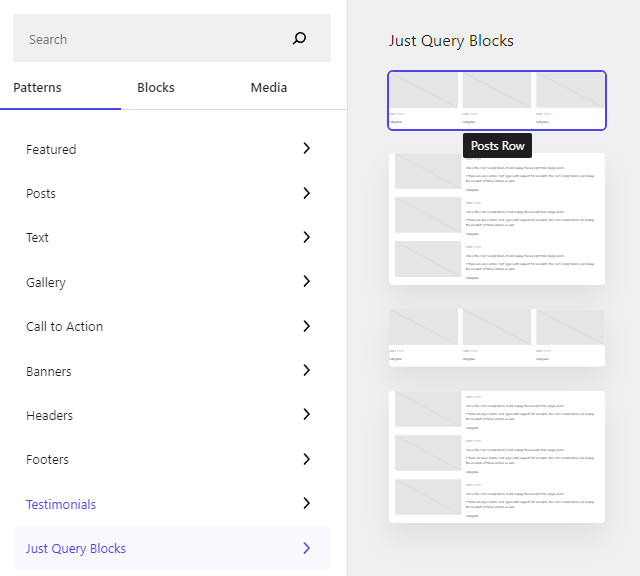

# Just Query Posts

Simple yet powerful post querying blocks designed for editorial teams to manage their publication homepage composition.
Build a custom, dynamic powerful homepages entirely within Gutenberg.

## Query Block

The query block expands the block built into WordPress to enable powerful page composition. Posts can be brought in by
category, tag and author, prevernting duplicate posts from being displayed on the page (a vital feature missing
from core WordPress).

## Related Posts Block

This plugin also includes a simple yet powerful related posts block, which lets you automatically bring in posts related by category, tag, author.

## Block Patterns

There are a number of helpful block patterns to get you started:

## Demo

Take a look at the demo site for this plugin which has a basic homepage built using this plugin - https://demo.zacscott.net/
